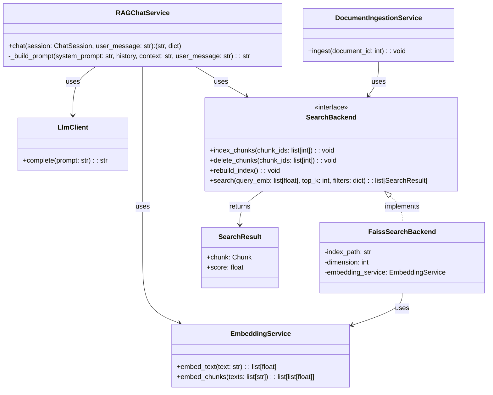

# サービス層のクラス図

## TODO:後で正式版に直す

```mermaid
classDiagram

class RAGChatService {
    +chat(session: ChatSession, user_message: str): (str, dict)
    -_build_prompt(system_prompt: str, history, context: str, user_message: str): str
}

class DocumentIngestionService {
    +ingest(document_id: int): void
}

class EmbeddingService {
    +embed_text(text: str): list[float]
    +embed_chunks(texts: list[str]): list[list[float]]
}

class LlmClient {
    +complete(prompt: str): str
}

class SearchBackend {
    <<interface>>
    +index_chunks(chunk_ids: list[int]): void
    +delete_chunks(chunk_ids: list[int]): void
    +rebuild_index(): void
    +search(query_emb: list[float], top_k: int, filters: dict): list[SearchResult]
}

class FaissSearchBackend {
    -index_path: str
    -dimension: int
    -embedding_service: EmbeddingService
}

class SearchResult {
    +chunk: Chunk
    +score: float
}

%% 関係

RAGChatService --> SearchBackend : uses
RAGChatService --> EmbeddingService : uses
RAGChatService --> LlmClient : uses

DocumentIngestionService --> SearchBackend : uses

SearchBackend <|.. FaissSearchBackend : implements
FaissSearchBackend --> EmbeddingService : uses

SearchBackend --> SearchResult : returns


```
