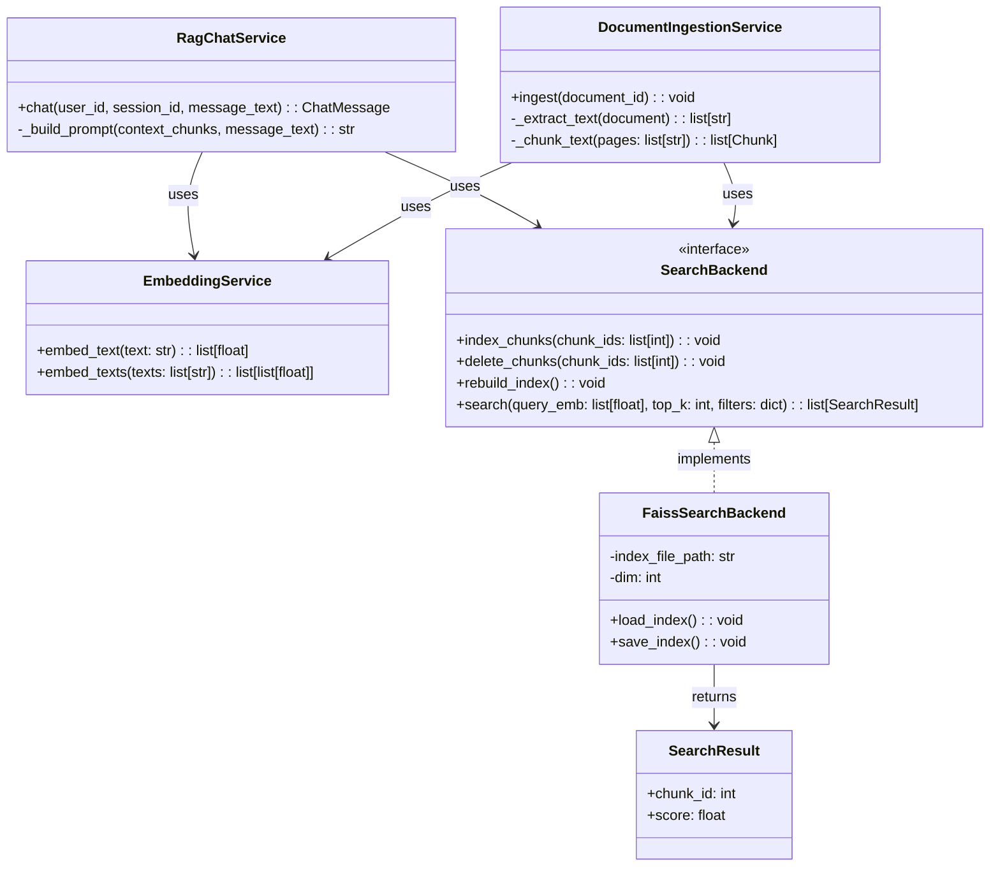

# サービス層のクラス図

## TODO:後で正式版に直す

```mermaid
classDiagram

class RagChatService {
    +chat(user_id, session_id, message_text): ChatMessage
    -_build_prompt(context_chunks, message_text): str
}

class DocumentIngestionService {
    +ingest(document_id): void
    -_extract_text(document): list[str]
    -_chunk_text(pages: list[str]): list[Chunk]
}

class EmbeddingService {
    +embed_text(text: str): list[float]
    +embed_texts(texts: list[str]): list[list[float]]
}

class SearchBackend {
    <<interface>>
    +index_chunks(chunk_ids: list[int]): void
    +delete_chunks(chunk_ids: list[int]): void
    +rebuild_index(): void
    +search(query_emb: list[float], top_k: int, filters: dict): list[SearchResult]
}

class FaissSearchBackend {
    -index_file_path: str
    -dim: int
    +load_index(): void
    +save_index(): void
}

class SearchResult {
    +chunk_id: int
    +score: float
}

%% 関係

RagChatService --> EmbeddingService : uses
RagChatService --> SearchBackend : uses
DocumentIngestionService --> EmbeddingService : uses
DocumentIngestionService --> SearchBackend : uses

SearchBackend <|.. FaissSearchBackend : implements
FaissSearchBackend --> SearchResult : returns

```
