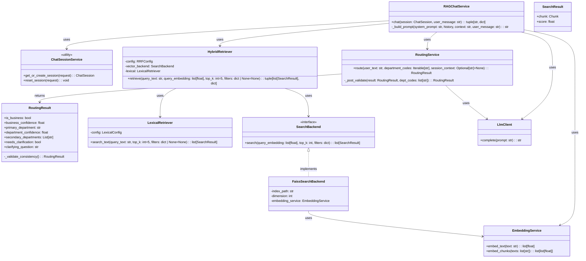
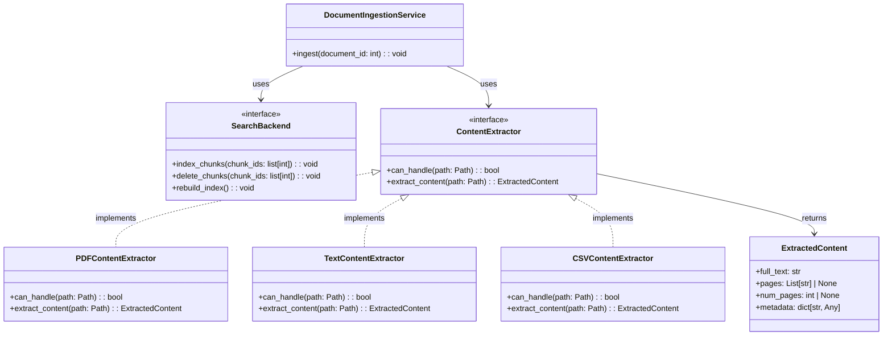

# サービス層のクラス図

## 図１(チャット回答・検索・ルーティング)

```mermaid
classDiagram

class RAGChatService {
  +chat(session: ChatSession, user_message: str): tuple[str, dict]
  -_build_prompt(system_prompt: str, history, context: str, user_message: str): str
}

class ChatSessionService {
  <<utility>>
  +get_or_create_session(request): ChatSession
  +reset_session(request): void
}

class RoutingService {
  +route(user_text: str, department_codes: Iterable[str], session_context: Optional[str]=None): RoutingResult
  -_post_validate(result: RoutingResult, dept_codes: list[str]): RoutingResult
}

class RoutingResult {
  +is_business: bool
  +business_confidence: float
  +primary_department: str
  +department_confidence: float
  +secondary_departments: List[str]
  +needs_clarification: bool
  +clarifying_question: str
  -_validate_consistency(): RoutingResult
}

class HybridRetriever {
  -config: RRFConfig
  -vector_backend: SearchBackend
  -lexical: LexicalRetriever
  +retrieve(query_text: str, query_embedding: list[float], top_k: int=5, filters: dict | None=None): tuple[list[SearchResult], dict]
}

class LexicalRetriever {
  -config: LexicalConfig
  +search_text(query_text: str, top_k: int=5, filters: dict | None=None): list[SearchResult]
}

class SearchBackend {
  <<interface>>
  +search(query_embedding: list[float], top_k: int, filters: dict): list[SearchResult]
}

class FaissSearchBackend {
  -index_path: str
  -dimension: int
  -embedding_service: EmbeddingService
}

class EmbeddingService {
  +embed_text(text: str): list[float]
  +embed_chunks(texts: list[str]): list[list[float]]
}

class LlmClient {
  +complete(prompt: str): str
}

class SearchResult {
  +chunk: Chunk
  +score: float
}

RAGChatService --> ChatSessionService : uses
RAGChatService --> RoutingService : uses
RAGChatService --> HybridRetriever : uses
RAGChatService --> EmbeddingService : uses
RAGChatService --> LlmClient : uses

RoutingService --> LlmClient : uses
RoutingService --> RoutingResult : returns

HybridRetriever --> SearchBackend : uses
HybridRetriever --> LexicalRetriever : uses

SearchBackend <|.. FaissSearchBackend : implements
FaissSearchBackend --> EmbeddingService : uses

```

---

## 図２（ドキュメント取り込み・抽出）

```mermaid

classDiagram

class DocumentIngestionService {
  +ingest(document_id: int): void
}

class SearchBackend {
  <<interface>>
  +index_chunks(chunk_ids: list[int]): void
  +delete_chunks(chunk_ids: list[int]): void
  +rebuild_index(): void
}

class ContentExtractor {
  <<interface>>
  +can_handle(path: Path): bool
  +extract_content(path: Path): ExtractedContent
}

class ExtractedContent {
  +full_text: str
  +pages: List[str] | None
  +num_pages: int | None
  +metadata: dict[str, Any]
}

class PDFContentExtractor {
  +can_handle(path: Path): bool
  +extract_content(path: Path): ExtractedContent
}

class TextContentExtractor {
  +can_handle(path: Path): bool
  +extract_content(path: Path): ExtractedContent
}

class CSVContentExtractor {
  +can_handle(path: Path): bool
  +extract_content(path: Path): ExtractedContent
}

DocumentIngestionService --> SearchBackend : uses
DocumentIngestionService --> ContentExtractor : uses

ContentExtractor <|.. PDFContentExtractor : implements
ContentExtractor <|.. TextContentExtractor : implements
ContentExtractor <|.. CSVContentExtractor : implements
ContentExtractor --> ExtractedContent : returns

```